Recipe Site Traffic - Technical Report
================

- <a href="#libraries" id="toc-libraries">Libraries</a>
- <a href="#business-problem" id="toc-business-problem">Business
  Problem</a>
- <a href="#final-summary" id="toc-final-summary">Final Summary</a>
  - <a href="#relationships-between-response--predictors"
    id="toc-relationships-between-response--predictors">Relationships
    Between Response &amp; Predictors</a>
  - <a href="#evaluating-models" id="toc-evaluating-models">Evaluating
    Models</a>
  - <a href="#connecting-model-to-business-value"
    id="toc-connecting-model-to-business-value">Connecting Model to Business
    Value</a>
  - <a href="#recommendations" id="toc-recommendations">Recommendations</a>
- <a href="#data-validation" id="toc-data-validation">Data Validation</a>
  - <a href="#recipe" id="toc-recipe">recipe</a>
  - <a href="#calories" id="toc-calories">calories</a>
  - <a href="#carbohydrate" id="toc-carbohydrate">carbohydrate</a>
  - <a href="#sugar" id="toc-sugar">sugar</a>
  - <a href="#protein" id="toc-protein">protein</a>
  - <a href="#category" id="toc-category">category</a>
  - <a href="#servings" id="toc-servings">servings</a>
  - <a href="#high_traffic" id="toc-high_traffic">high_traffic</a>
- <a href="#data-visulaization" id="toc-data-visulaization">Data
  Visulaization</a>
  - <a href="#response-visualization"
    id="toc-response-visualization">Response Visualization</a>
  - <a href="#response-vs-numeric-predictors"
    id="toc-response-vs-numeric-predictors">Response Vs Numeric
    Predictors</a>
  - <a href="#response-vs-categorical--discrete-predictors"
    id="toc-response-vs-categorical--discrete-predictors">Response Vs
    Categorical &amp; Discrete Predictors</a>
  - <a href="#response-vs-missing-values"
    id="toc-response-vs-missing-values">Response vs Missing Values</a>
  - <a href="#model-development" id="toc-model-development">Model
    Development</a>
  - <a href="#baseline-model-glmnet" id="toc-baseline-model-glmnet">Baseline
    Model: glmnet</a>
  - <a href="#comparison-model-xgboost"
    id="toc-comparison-model-xgboost">Comparison Model: XGBOOST</a>
- <a href="#model-evaluation" id="toc-model-evaluation">Model
  Evaluation</a>
  - <a href="#pr-auc" id="toc-pr-auc">PR AUC</a>
  - <a href="#roc-auc" id="toc-roc-auc">ROC AUC</a>
  - <a href="#test-set-results" id="toc-test-set-results">Test Set
    Results</a>
  - <a href="#precision-vs-recall-curve"
    id="toc-precision-vs-recall-curve">Precision vs Recall Curve</a>
  - <a href="#roc-curve" id="toc-roc-curve">ROC Curve</a>
- <a href="#business-metrics" id="toc-business-metrics">Business
  Metrics</a>
  - <a href="#explaining-gainlift" id="toc-explaining-gainlift">Explaining
    Gain/Lift</a>
  - <a href="#glmnet-gain" id="toc-glmnet-gain">GLMNET Gain</a>
  - <a href="#xgboost-gain" id="toc-xgboost-gain">XGBOOST Gain</a>
  - <a href="#glmnet-lift" id="toc-glmnet-lift">GLMNET Lift</a>
  - <a href="#xgboost-lift" id="toc-xgboost-lift">XGBOOST Lift</a>
- <a href="#final-summary-1" id="toc-final-summary-1">Final Summary</a>
  - <a href="#relationships-between-response--predictors-1"
    id="toc-relationships-between-response--predictors-1">Relationships
    Between Response &amp; Predictors</a>
  - <a href="#evaluating-models-1" id="toc-evaluating-models-1">Evaluating
    Models</a>
  - <a href="#connecting-model-to-business-value-1"
    id="toc-connecting-model-to-business-value-1">Connecting Model to
    Business Value</a>
  - <a href="#recommendations-1"
    id="toc-recommendations-1">Recommendations</a>

## Libraries

``` r
library(tidyverse)
```

    ## ── Attaching packages ─────────────────────────────────────── tidyverse 1.3.2 ──
    ## ✔ ggplot2 3.4.0     ✔ purrr   1.0.1
    ## ✔ tibble  3.1.8     ✔ dplyr   1.1.0
    ## ✔ tidyr   1.3.0     ✔ stringr 1.5.0
    ## ✔ readr   2.1.3     ✔ forcats 1.0.0
    ## ── Conflicts ────────────────────────────────────────── tidyverse_conflicts() ──
    ## ✖ dplyr::filter() masks stats::filter()
    ## ✖ dplyr::lag()    masks stats::lag()

``` r
library(tidymodels)
```

    ## ── Attaching packages ────────────────────────────────────── tidymodels 1.0.0 ──
    ## ✔ broom        1.0.3     ✔ rsample      1.1.1
    ## ✔ dials        1.1.0     ✔ tune         1.0.1
    ## ✔ infer        1.0.4     ✔ workflows    1.1.2
    ## ✔ modeldata    1.1.0     ✔ workflowsets 1.0.0
    ## ✔ parsnip      1.0.3     ✔ yardstick    1.1.0
    ## ✔ recipes      1.0.4     
    ## ── Conflicts ───────────────────────────────────────── tidymodels_conflicts() ──
    ## ✖ scales::discard() masks purrr::discard()
    ## ✖ dplyr::filter()   masks stats::filter()
    ## ✖ recipes::fixed()  masks stringr::fixed()
    ## ✖ dplyr::lag()      masks stats::lag()
    ## ✖ yardstick::spec() masks readr::spec()
    ## ✖ recipes::step()   masks stats::step()
    ## • Use tidymodels_prefer() to resolve common conflicts.

``` r
library(ggrepel)
library(naniar)

rct_raw_tbl <- read_csv("00_data/recipe_site_traffic_2212.csv")
```

    ## Rows: 947 Columns: 8
    ## ── Column specification ────────────────────────────────────────────────────────
    ## Delimiter: ","
    ## chr (4): recipe, category, servings, high_traffic
    ## dbl (4): calories, carbohydrate, sugar, protein
    ## 
    ## ℹ Use `spec()` to retrieve the full column specification for this data.
    ## ℹ Specify the column types or set `show_col_types = FALSE` to quiet this message.

``` r
rct_raw_tbl %>% glimpse()
```

    ## Rows: 947
    ## Columns: 8
    ## $ recipe       <chr> "001", "002", "003", "004", "005", "006", "007", "008", "…
    ## $ calories     <dbl> NA, 35.48, 914.28, 97.03, 27.05, 691.15, 183.94, 299.14, …
    ## $ carbohydrate <dbl> NA, 38.56, 42.68, 30.56, 1.85, 3.46, 47.95, 3.17, 3.78, 4…
    ## $ sugar        <dbl> NA, 0.66, 3.09, 38.63, 0.80, 1.65, 9.75, 0.40, 3.37, 3.99…
    ## $ protein      <dbl> NA, 0.92, 2.88, 0.02, 0.53, 53.93, 46.71, 32.40, 3.79, 11…
    ## $ category     <chr> "Pork", "Potato", "Breakfast", "Beverages", "Beverages", …
    ## $ servings     <chr> "6", "4", "1", "4", "4", "2", "4", "4", "6", "2", "1", "6…
    ## $ high_traffic <chr> "High", "High", NA, "High", NA, "High", NA, NA, "High", N…

## Business Problem

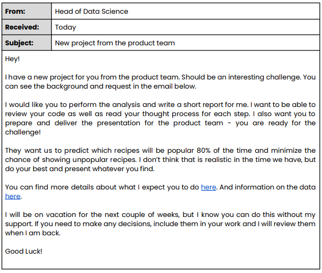

## Final Summary

### Relationships Between Response & Predictors

I discovered that the most important predictor is the recipe category in
predicting “High” traffic.. Both the EDA and modeling process validate
this claim. There seems to be a mild relationship between the missing
values in the data and “High” traffic recipes.

### Evaluating Models

“They want us to predict which recipes will be popular 80% of the time
and minimize the chance of showing unpopular recipes.”

- Both models can achieve a precision of 80.42% on never before seen
  data.
- On never before seen data, 28 out of 96 (or 29.17%) “Not-High” traffic
  recipes were incorrectly classified as “High” traffic recipes.
- The baseline model (glmnet) was the best performing model in terms of
  PR AUC and ROC AUC.

In order to improve accuracy we can explore more features. The “Example
Recipe” from the instructions document included features such as:

- **Title:**: “Tomato Soup”
- **Time to make:** “2 hours”
- **Cost per serving**
- **ingredients:** “Tomatoes, Onion, Carrot, Vegetable Stock”
- **Method:** “1. Cut the tomatoes into quarters…”

These may add predictive value to our model.

### Connecting Model to Business Value

I used Gain & Lift charts to connect the best performing model to
business goals. When sorted by highest probability of “High” traffic
recipes, the first 25% of our recipes is estimated to gain close to 40%
of the “High” traffic recipes, a 15% improvement over the baseline of
25%, which translates to close to a 1.6X Lift.

### Recommendations

I recommend:

- Iteratively improving the model over time with:
  - additional features
  - additional observations
  - screening more models and preprocessing techniques
- Utilize the current model as it’s shown to meet targets and provide
  business value, time to put the model into production.

## Data Validation

``` r
rct_tbl <- rct_raw_tbl %>% 
    mutate(recipe = factor(recipe),
           high_traffic = ifelse(is.na(high_traffic), "Not-High", high_traffic) %>% as_factor,
           servings = servings %>% str_remove_all("\\s+as\\s+a\\s+snack$") %>% as.integer,
           category = category %>% str_remove_all("\\s+Breast$") %>% as_factor())

rct_tbl %>% glimpse()
```

    ## Rows: 947
    ## Columns: 8
    ## $ recipe       <fct> 001, 002, 003, 004, 005, 006, 007, 008, 009, 010, 011, 01…
    ## $ calories     <dbl> NA, 35.48, 914.28, 97.03, 27.05, 691.15, 183.94, 299.14, …
    ## $ carbohydrate <dbl> NA, 38.56, 42.68, 30.56, 1.85, 3.46, 47.95, 3.17, 3.78, 4…
    ## $ sugar        <dbl> NA, 0.66, 3.09, 38.63, 0.80, 1.65, 9.75, 0.40, 3.37, 3.99…
    ## $ protein      <dbl> NA, 0.92, 2.88, 0.02, 0.53, 53.93, 46.71, 32.40, 3.79, 11…
    ## $ category     <fct> Pork, Potato, Breakfast, Beverages, Beverages, One Dish M…
    ## $ servings     <int> 6, 4, 1, 4, 4, 2, 4, 4, 6, 2, 1, 6, 4, 4, 4, 6, 2, 1, 6, …
    ## $ high_traffic <fct> High, High, Not-High, High, Not-High, High, Not-High, Not…

### recipe

The column **recipe** is of class *character* by default and contains
unique indentifiers for each recipe ranging from recipe “001” to recipe
“947”. There are 947 unique values and zero missing values. As the
values have no numeric meaning, i.e. recipe “947” is not greater than
recipe “001”, I converted to class *factor* instead of *numeric*.

### calories

The column **calories** is of class *double* by default and has 52
missing values. The minimum value is 0.14 and the maximum value is
3633.16. The median is 288.55, whereas the mean is 435.94, indicating a
right skewed distribution. The column is the appropriate class so no
class conversion is needed.

### carbohydrate

The column **carbohydrate** is of class *double* by default and has 52
missing values. The minimum value is 0.03 and the maximum value is
530.42. The median is 21.48, whereas the mean is 35.07, indicating a
right skewed distribution. The column is the appropriate class so no
class conversion is needed.

### sugar

The column **sugar** is of class *double* by default and has 52 missing
values. The minimum value is 0.01 and the maximum value is 148.75. The
median is 4.55, whereas the mean is 9.04, indicating a right skewed
distribution. The column is the appropriate class so no class conversion
is needed.

### protein

The column **protein** is of class *double* by default and has 52
missing values. The minimum value is 0 and the maximum value is 363.36.
The median is 10.8, whereas the mean is 24.15, indicating a right skewed
distribution. The column is the appropriate class so no class conversion
is needed.

### category

The column **category** is of class *character* and contains eleven
unique values and zero missing values by default. The instructions note
there should be only 10 unique values. The additional unique value stems
from “Chicken Breast”. As “Chicken” is one of the possible unique values
I simply removed the “Breast” from “Chicken Breast” using
`stringr::str_remove_all()` and the following regex: `"\\s+Breast$"`

- `"\\s+"`: matches one or more whitespace.
- `"Breast"`: simply matches “Breast”.
- `"$"`: matches the end of the string.

The column has a fixed and known set of possible values so I also
converted to *factor*.

### servings

The column **servings** is of class *character* and contains six unique
values and zero missing values by default. The instructions note that
servings should be of class *numeric*. Some of the values are appended
with “as a snack”. I removed “as a snack” using
`stringr::str_remove_all()` and the following regex:
`"\\s+as\\s+a\\s+snack$"`

- `"\\s+"`: matches one or more whitespace.
- `"$"`: matches the end of the string.

`stringr::str_sub()` could also be used.

The column has a discrete set of numeric values so I converted to type
*integer*.

### high_traffic

The column **high_traffic** is of class *character* and contains two
unique values which includes 373 missing values. I will encode the
missing values as “Not-High”. The column has a fixed and known set of
possible values so I also converted to *factor*.

## Data Visulaization

### Response Visualization

``` r
rct_tbl %>% 
    ggplot(aes(high_traffic)) +
    geom_bar(fill = "steelblue") +
    geom_label(stat = "count", aes(label = after_stat(count)), size = 5) +
    theme_bw() +
    labs(title = "Count of High and Not-High",  
         x = "", 
         y = "Count")
```

<!-- -->

The category with the most number of observations is “High” owners with
574 observations. The number of “Not-High” is 373. This means the
categories are a little imbalanced.

``` r
binom_stats <- function(x, response_value, ...) {
    x <- x$high_traffic[!is.na(x$high_traffic)]
    res <- prop.test(x = sum(x == response_value), n = length(x), ...)
  tibble(Proportion  = unname(res$estimate), 
             Lower = res$conf.int[1],
             Upper = res$conf.int[2])
}

high_traffic_tbl <- binom_stats(rct_tbl, "High") %>% 
    add_column(Traffic = "High", .before = 1) %>% 
    bind_rows(
        binom_stats(rct_tbl, "Not-High") %>% 
        add_column(Traffic = "Not-High", .before = 1)
    ) %>% 
    mutate(text_label = str_glue("Proportion: {scales::percent(Proportion, accuracy = 0.01)}
Upper: {scales::percent(Upper, accuracy = 0.01)}
Lower: {scales::percent(Lower, accuracy = 0.01)}"))

high_traffic_tbl %>% 
    ggplot(aes(Traffic, Proportion)) +
    geom_point(size = 2) +
    geom_errorbar(aes(ymin = Lower, ymax = Upper), width = 0.1) +
    geom_label_repel(aes(label = text_label), point.padding = 25, size = 4) +
    scale_y_continuous(labels = scales::percent) +
    expand_limits(y = c(0, 1)) +
    theme_bw() +
    labs(title = "Proportion of High and Not-High Traffic with 95% Confidence Interval",
         x = "")
```

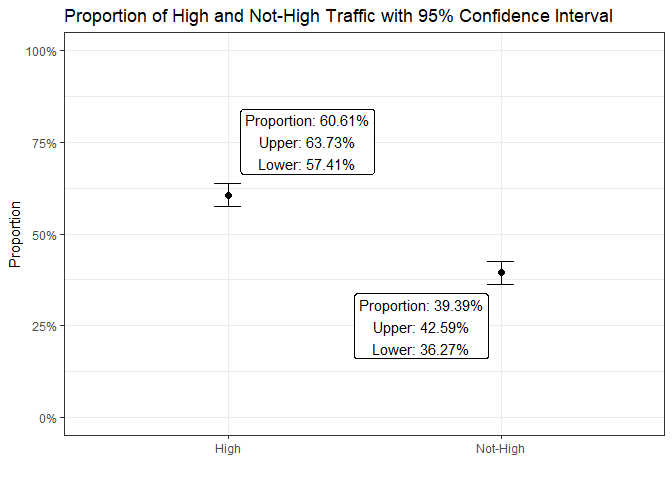<!-- -->

When it comes to predicting whether traffic is “High” vs “Not-High” we
would be right around 63.73% of the time if we predicted “High” for
every recipe. I’ve included a 95% confidence interval for the proportion
plot to help the reader understand how much the proportion should be
trusted.

### Response Vs Numeric Predictors

``` r
rct_tbl %>% 
    select(high_traffic, where(is.numeric), -servings) %>% 
    pivot_longer(-high_traffic) %>% 
    ggplot(aes(value, fill = high_traffic)) + 
    geom_density(alpha = 0.5) +
    scale_fill_manual(values = c("High" = "steelblue", "Not-High" = "red")) +
    facet_wrap(~ name, ncol = 1, scales = "free") +
    theme_bw() +
    labs(title = "Distribution of Numeric Values Partitioned by Traffic",
         x = "Value", y = "Density", fill = "High Traffic")
```

    ## Warning: Removed 208 rows containing non-finite values (`stat_density()`).

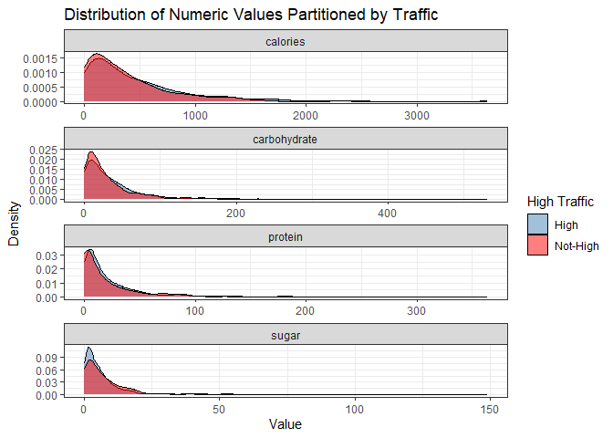<!-- -->

As we can see from the plot above the distributions of all the numeric
values have very similar shapes when partitioned by traffic. There is a
single mode at lower end of each value and the data is highly right
skewed for each numeric column. The modes are not as high in some of the
columns for “Not-High” but this can be accounted for by the lower
frequency of the “Not-High” category. This indicates that the numeric
columns should add little value when predicting traffic.

### Response Vs Categorical & Discrete Predictors

``` r
high_prop <- mean(rct_tbl$high_traffic == "High")

category_tbl <- rct_tbl %>% 
    select(high_traffic, category) %>% 
    nest_by(category) %>% 
    mutate(stats = list(binom_stats(data, "High"))) %>% 
    select(-data) %>% 
    unnest(stats) %>%
    ungroup() %>% 
    add_column(name = "category", .before = 1) %>% 
    rename(value = category) %>% 
    arrange(Proportion) %>% 
    mutate(value = factor(value))

servings_tbl <- rct_tbl %>% 
    select(high_traffic, servings) %>% 
    nest_by(servings) %>% 
    mutate(stats = list(binom_stats(data, "High"))) %>% 
    select(-data) %>% 
    unnest(stats) %>%
    ungroup() %>% 
    add_column(name = "servings", .before = 1) %>% 
    rename(value = servings) %>% 
    mutate(value = factor(value))

bind_rows(category_tbl, servings_tbl) %>% 
    mutate(value = fct_reorder(value, Proportion)) %>%
    ggplot(aes(value, Proportion)) +
    geom_point(size = 2) +
    geom_hline(aes(yintercept = high_prop), linetype = 2, color = "red") +
    geom_errorbar(aes(ymin = Lower, ymax = Upper), width = 0.1) +
    scale_y_continuous(labels = scales::percent) +
    expand_limits(y = c(0, 1)) +
    facet_wrap(~ name, scales = "free", ncol = 1) +
    theme_bw() +
    theme(axis.text.x = element_text(angle = 45, hjust = 1)) +
    labs(title = "Proportion of High Traffic Across Category with 95% Confidence Interval",
         x = "")
```

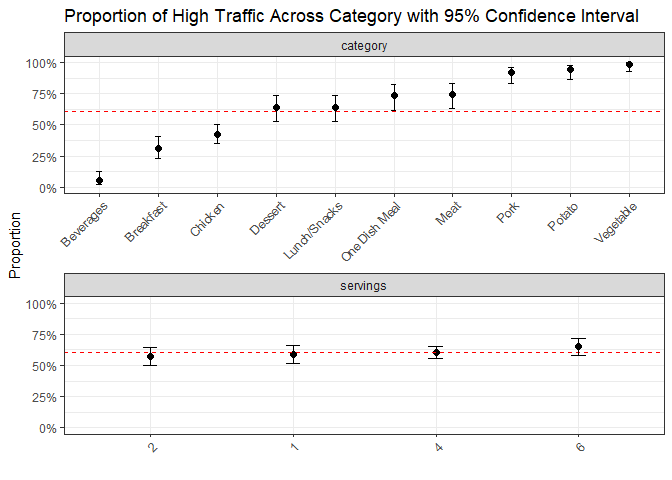<!-- -->

The plot above shows for each category and each serving size, the
proportion of “High” vs “Not-High” traffic and a 95% confidence interval
to help understand what the noise is around the value. I’ve also
included, using a red dashed line, the baseline proportion of “High”
traffic for the whole dataset.

From the category column, we can now see that:

- Beverages, Breakfast and Chicken recipes have a lower than baseline
  proportion of “High” traffic, with Beverages having a very low
  proportion of “High” traffic.
- Dessert and Lunch/Snacks are close to the baseline of “High” traffic.
- One Dish Meal, Meat, Pork, Potato and Vegetables are above the
  baseline of “High” traffic, with Pork, Potato and Vegetable being
  close to 100% Proportion.

This indicates that recipe category will be very useful in predicting
traffic.

From the servings column, we can see that there is overlap with all the
serving sizes’ 95% confidence interval and the baseline proportion of
“High” traffic. This indicates that serving size will not be a very
useful in predicting traffic.

### Response vs Missing Values

``` r
vis_miss(rct_tbl %>% arrange(calories))
```

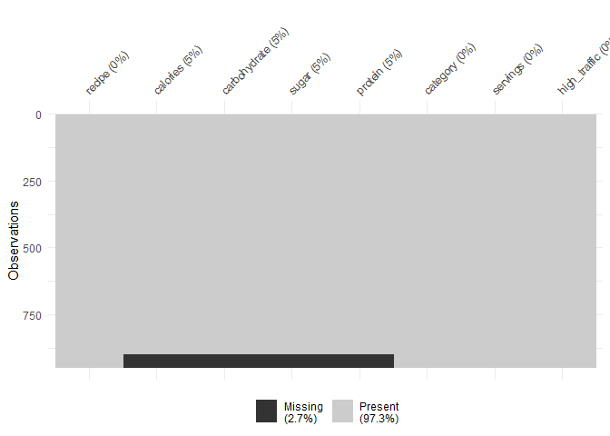<!-- -->

As we can see from the visualization the missing values among the
columns calories, carbohydrate, sugar and protein have a pattern, when
one has a missing value they all have a missing value.

``` r
rct_tbl %>% 
    mutate(missing = ifelse(is.na(calories), "Missing", "Not-Missing")) %>% 
    select(high_traffic, missing) %>% 
    nest_by(missing) %>% 
    mutate(stats = list(binom_stats(data, "High"))) %>% 
    select(-data) %>% 
    unnest(stats) %>%
    ungroup() %>% 
    ggplot(aes(missing, Proportion)) +
    geom_point(size = 2) +
    geom_hline(aes(yintercept = high_prop), linetype = 2, color = "red") +
    geom_errorbar(aes(ymin = Lower, ymax = Upper), width = 0.1) +
    scale_y_continuous(labels = scales::percent) +
    expand_limits(y = c(0, 1)) +
    theme_bw() +
    labs(title = "Proportion of High Traffic with 95% Confidence Interval",
         x = "")
```

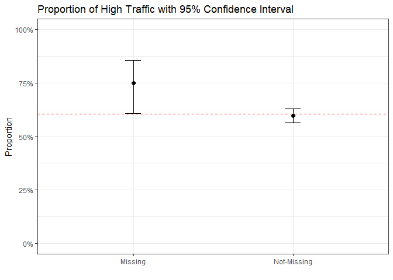<!-- -->

While there is some overlap between the errorbars, it seems that there
is in fact a relationship between the response and missing values. When
a value is missing it tends to have a higher proportion of recipes with
“High” traffic. I will add a column flagging missing to the modeling
process.

``` r
rct_tbl <- rct_tbl %>% 
    mutate(missing = ifelse(is.na(calories), "Missing", "Not-Missing"))
```

### Model Development

The outcome value has one of two possible values, “High” or “Not-High”.
As our outcome only has two possible values we use classification, in
specific binary classification, to predict whether a recipe will
generate high traffic or not.

The EDA has revealed that the category column and the flagged missing
column are, obstensibly, the only predictors with a meaningful
relationship with high_trafic. I will therefore be trying the following
preprocessing recipes:

1.  A baseline recipe with category and missing as the predictors.
2.  A recipe with all the predictors but with filtered missing values.
3.  A recipe with all the predictors. (This recipe will be exclusive to
    the comparison model, XGBOOST, which is robust against missing
    values)

Models like XGBOOST can essentially memorize the training set.
Therefore, I’ll use cross-validation, a well established method for
screening many models at once, to compare the models. Cross-validation
is used to ensure model evaluation statistics are not unrealistically
optimistic. I’ll also train using a variety of hyperparameters to give
each model it’s best chance.

### Baseline Model: glmnet

- The algorithm is extremely fast.
- It fits linear, logistic and multinomial, poisson and Cox regression
  models.
- It has an option for regularized regression, encouraging simplicity by
  removing predictors and/or shrinking their coefficients towards zero.
- Coefficients provide inference.

### Comparison Model: XGBOOST

- Transforming continuous variables are not required for this model.
- Robust to outliers.
- Robust to missing values.
- Works well with non-linear data.
- Works well with interaction effect between predictors.
- Often produces better accuracy than other algorithms.

``` r
set.seed(123)
splits <- initial_split(rct_tbl, strata = missing)
folds <- vfold_cv(training(splits), strata = missing)

baseline_recipe <- training(splits) %>% 
    recipe(high_traffic ~ category, missing) %>%
    step_dummy(all_nominal_predictors(), one_hot = TRUE) %>% 
    step_normalize(all_predictors()) 

naomit_recipe <- training(splits) %>% 
    recipe(high_traffic ~ .) %>%
    update_role(recipe, new_role = "id") %>%
    step_rm(missing) %>% 
    step_naomit(everything()) %>% 
    step_dummy(all_nominal_predictors(), one_hot = TRUE) %>% 
    step_normalize(all_predictors()) 

xgb_recipe <- training(splits) %>% 
    recipe(high_traffic ~ .) %>%
    update_role(recipe, new_role = "id") %>%
    step_dummy(all_nominal_predictors(), one_hot = TRUE) %>% 
    step_normalize(all_predictors()) 

glmnet_spec <- logistic_reg(penalty = tune(), mixture = tune()) %>% 
    set_engine("glmnet") %>% 
    set_mode("classification")

xgb_spec <- boost_tree(mtry = tune(), trees = 1000, min_n = tune(), tree_depth = tune(), learn_rate = tune(), loss_reduction = tune()) %>% 
    set_engine("xgboost") %>% 
    set_mode("classification")

xgb_wflw <- workflow() %>% 
    add_model(xgb_spec) %>% 
    add_recipe(xgb_recipe)

rct_models <- 
    workflow_set(
        preproc = list(
            baseline   = baseline_recipe,
            naomit     = naomit_recipe
        ),
        models = list(
            glmnet  = glmnet_spec,
            xgboost = xgb_spec
        ),
        cross = TRUE
    )  %>% 
    bind_rows(
        as_workflow_set(xgb_rec_xgboost = xgb_wflw)
    )

grid_ctrl <-
   control_grid(
      save_pred = TRUE,
      save_workflow = TRUE
   )

grid_results <-
   rct_models %>%
   workflow_map(
      seed = 234,
      resamples = folds,
      grid = 10,
      control = grid_ctrl,
      metrics = metric_set(roc_auc, pr_auc)
   )
```

    ## i Creating pre-processing data to finalize unknown parameter: mtry
    ## i Creating pre-processing data to finalize unknown parameter: mtry
    ## i Creating pre-processing data to finalize unknown parameter: mtry

## Model Evaluation

“They want us to predict which recipes will be popular 80% of the time
and minimize the chance of showing unpopular recipes.”

There business is interested in two clear metrics:

- **Precision:** When the model has a precision of 0.8, it predicts a
  recipe will generate “High” traffic 80% of the time. Unfortunately,
  precision and recall are often in tension. That is, improving
  precision typically reduces recall and vice versa. Therefore, you must
  examine both precision and recall. I will do this using the area under
  the precision-recall curve (PR AUC).
- **False Positive Rate:** Again, the False Positive rate is in tension
  with recall. Lowering the classification threshold classifies more
  items as positive, thus increasing both False Positives and True
  Positives. Increasing the classification threshold classifies more
  items as negative, thus increasing both False Negatives and True
  Negatives. Therefore, I will use the area under a receiver operating
  characteristic curve (ROC AUC), to help evaluate the models.

### PR AUC

``` r
grid_results %>% 
    autoplot(metric = "pr_auc") +
    scale_colour_manual(values = c("logistic_reg" = "steelblue", "boost_tree" = "red")) +
    theme_bw() +
    labs(title = "Estimated PR AUC")
```

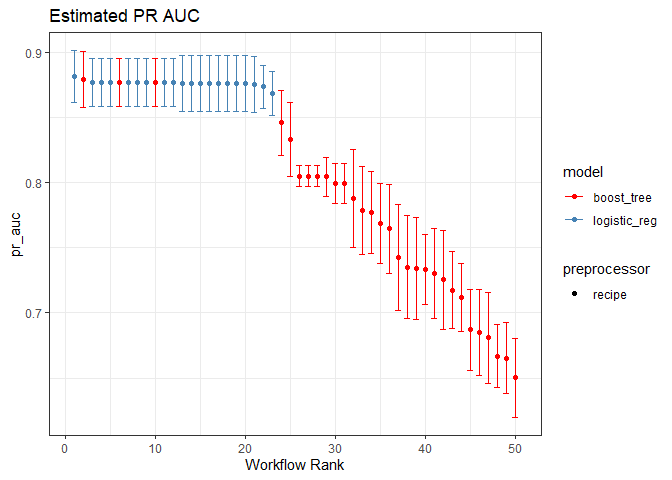<!-- -->

### ROC AUC

``` r
grid_results %>% 
    autoplot(metric = "roc_auc") +
    scale_colour_manual(values = c("logistic_reg" = "steelblue", "boost_tree" = "red")) +
    theme_bw() +
    labs(title = "Estimated ROC AUC")
```

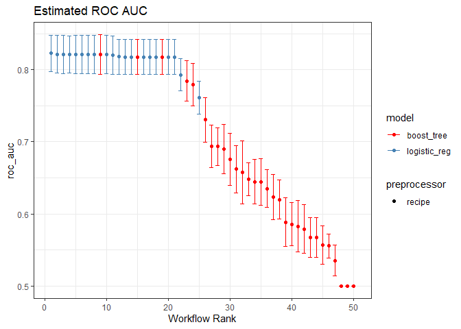<!-- -->

``` r
grid_results %>% rank_results(select_best = TRUE)
```

    ## # A tibble: 10 × 9
    ##    wflow_id         .config      .metric  mean std_err     n prepr…¹ model  rank
    ##    <chr>            <chr>        <chr>   <dbl>   <dbl> <int> <chr>   <chr> <int>
    ##  1 baseline_glmnet  Preprocesso… pr_auc  0.881  0.0121    10 recipe  logi…     1
    ##  2 baseline_glmnet  Preprocesso… roc_auc 0.823  0.0156    10 recipe  logi…     1
    ##  3 naomit_glmnet    Preprocesso… pr_auc  0.876  0.0130    10 recipe  logi…     2
    ##  4 naomit_glmnet    Preprocesso… roc_auc 0.822  0.0160    10 recipe  logi…     2
    ##  5 baseline_xgboost Preprocesso… pr_auc  0.879  0.0130    10 recipe  boos…     3
    ##  6 baseline_xgboost Preprocesso… roc_auc 0.821  0.0166    10 recipe  boos…     3
    ##  7 xgb_rec_xgboost  Preprocesso… pr_auc  0.846  0.0152    10 recipe  boos…     4
    ##  8 xgb_rec_xgboost  Preprocesso… roc_auc 0.784  0.0171    10 recipe  boos…     4
    ##  9 naomit_xgboost   Preprocesso… pr_auc  0.833  0.0174    10 recipe  boos…     5
    ## 10 naomit_xgboost   Preprocesso… roc_auc 0.779  0.0181    10 recipe  boos…     5
    ## # … with abbreviated variable name ¹​preprocessor

Scoring a PR AUC of 0.881 and a ROC AUC of 0.8228, the baseline model
(glmnet) using only category and missing as predictors is the best
performing model. The best performing comparison model (XGBOOST) uses
the same preprocessing technique and scores a PR AUC of 0.8789 and a ROC
AUC of 0.8212. These models and their hyperparameters will be used
moving forward.

### Test Set Results

``` r
best_results_glmnet <- 
    grid_results %>% 
    extract_workflow_set_result("baseline_glmnet") %>% 
    select_best(metric = "roc_auc")

best_results_xgb <- 
    grid_results %>% 
    extract_workflow_set_result("baseline_xgboost") %>% 
    select_best(metric = "roc_auc")

set.seed(345)
baseline_model_test_results <- 
    grid_results %>% 
    extract_workflow("baseline_glmnet") %>% 
    finalize_workflow(best_results_glmnet) %>% 
    last_fit(split = splits, metrics = metric_set(precision, specificity, pr_auc, roc_auc))

set.seed(456)
comparison_model_test_results <- 
    grid_results %>% 
    extract_workflow("baseline_xgboost") %>% 
    finalize_workflow(best_results_xgb) %>% 
    last_fit(split = splits, metrics = metric_set(precision, specificity, pr_auc, roc_auc))

baseline_model_test_results %>% 
    collect_metrics() %>% 
    add_column(model = "glmnet") %>% 
    bind_rows(
        comparison_model_test_results %>% 
            collect_metrics() %>% 
            add_column(model = "xgboost")
    ) %>% 
    select(model, .metric, .estimate) %>% 
    mutate(.estimate = ifelse(.metric == "specificity", 1-.estimate, .estimate),
           .metric = ifelse(.metric == "specificity", "false_positive_rate", .metric)) %>% 
    knitr::kable()
```

| model   | .metric             | .estimate |
|:--------|:--------------------|----------:|
| glmnet  | precision           | 0.8041958 |
| glmnet  | false_positive_rate | 0.2916667 |
| glmnet  | pr_auc              | 0.9116228 |
| glmnet  | roc_auc             | 0.8611480 |
| xgboost | precision           | 0.8041958 |
| xgboost | false_positive_rate | 0.2916667 |
| xgboost | pr_auc              | 0.8993075 |
| xgboost | roc_auc             | 0.8564569 |

At the default classification threshold, both models scored a Precision
of 0.8042 on never before seen data, so both models meet the request to
correctly predict high traffic recipes 80% of the time.

The business is also interested in minimizing the chance of showing
unpopular recipes. At the default classification threshold, both models
scored a False Positive Rate of 29.17% on never before seen data. This
means that from the 96 total “Not-High” in the test set, 28 were
classified as “High”.

glmnet remains the best performing model on never before seen data with
a PR AUC of 0.9116, compared to xgboost’s 0.8993, and an ROC AUC of
0.8611, compared to xgboost’s 0.8565.

I will include a precision vs recall plot and a ROC curve plot incase
the reader wishes to investigate the adjustment of the classification
threshold on precision, recall (true positive rate) and 1 - specificity
(false positive rate).

``` r
# testing(splits) %>% 
#   count(high_traffic)
```

### Precision vs Recall Curve

``` r
baseline_model_test_results %>% 
    augment() %>% 
    pr_curve(high_traffic, .pred_High) %>% 
    add_column(model = "glmnet", auc = "0.8611") %>% 
    bind_rows(
        comparison_model_test_results %>% 
            augment() %>% 
            pr_curve(high_traffic, .pred_High) %>% 
            add_column(model = "xgboost", auc = "0.8565")
    ) %>% 
    ggplot(aes(recall, precision, color = model, linetype = auc)) +
    geom_line() +
    theme_bw() +
    scale_color_manual(values = c("glmnet" = "steelblue", "xgboost" = "red")) +
    labs(
        title = "Precision vs Recall Curve",
        color = "Model",
        linetype = "ROC AUC"
    )
```

    ## Warning: Returning more (or less) than 1 row per `summarise()` group was deprecated in
    ## dplyr 1.1.0.
    ## ℹ Please use `reframe()` instead.
    ## ℹ When switching from `summarise()` to `reframe()`, remember that `reframe()`
    ##   always returns an ungrouped data frame and adjust accordingly.
    ## ℹ The deprecated feature was likely used in the yardstick package.
    ##   Please report the issue at <]8;;https://github.com/tidymodels/yardstick/issueshttps://github.com/tidymodels/yardstick/issues]8;;>.

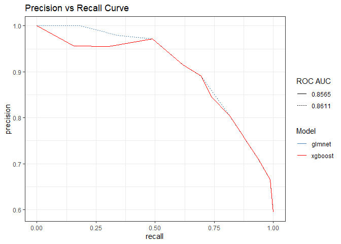<!-- -->

### ROC Curve

``` r
baseline_model_test_results %>% 
    augment() %>% 
    roc_curve(high_traffic, .pred_High) %>% 
    add_column(model = "glmnet", auc = "0.8611") %>% 
    bind_rows(
        comparison_model_test_results %>% 
            augment() %>% 
            roc_curve(high_traffic, .pred_High) %>% 
            add_column(model = "xgboost", auc = "0.8565")
    ) %>% 
    ggplot(aes(1-specificity, sensitivity, color = model, linetype = auc)) +
    geom_line() +
    theme_bw() +
    scale_color_manual(values = c("glmnet" = "steelblue", "xgboost" = "red")) +
    labs(
        title = "ROC Curve",
        color = "Model",
        linetype = "ROC AUC",
        x = "False Positive Rate",
        y = "Recall"
    )
```

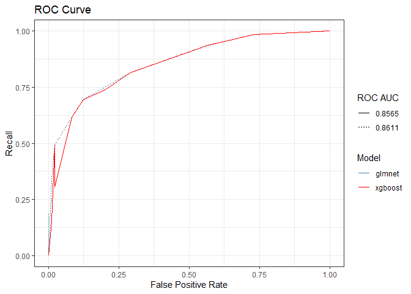<!-- -->

## Business Metrics

``` r
set.seed(567)
baseline_model_refit <- grid_results %>% 
   extract_workflow("baseline_glmnet") %>% 
   finalize_workflow(best_results_glmnet) %>% 
   fit(rct_tbl)

set.seed(678)
comparison_model_refit <- grid_results %>% 
   extract_workflow("baseline_xgboost") %>% 
   finalize_workflow(best_results_xgb) %>% 
   fit(rct_tbl)

glmnet_pred_tbl <- baseline_model_refit %>% 
    augment(rct_tbl) %>% 
    select(high_traffic, starts_with(".pred")) %>% 
    arrange(desc(.pred_High))

xgb_pred_tbl <- comparison_model_refit %>% 
    augment(rct_tbl) %>% 
    select(high_traffic, starts_with(".pred")) %>% 
    arrange(desc(.pred_High))

glmnet_pred_tbl %>% head(10) %>% 
    mutate(`High Probability` = scales::percent(.pred_High, accuracy = 0.01)) %>% 
    select(-`.pred_Not-High`, -`.pred_High`) %>% 
    rename(`Actual Value` = high_traffic, `Predicted Value`= .pred_class) %>% 
    knitr::kable()
```

| Actual Value | Predicted Value | High Probability |
|:-------------|:----------------|:-----------------|
| High         | High            | 92.64%           |
| High         | High            | 92.64%           |
| High         | High            | 92.64%           |
| High         | High            | 92.64%           |
| High         | High            | 92.64%           |
| High         | High            | 92.64%           |
| High         | High            | 92.64%           |
| High         | High            | 92.64%           |
| High         | High            | 92.64%           |
| High         | High            | 92.64%           |

### Explaining Gain/Lift

In the table above, in the first 10 observations we had a 100% accuracy
(10 out of 10 recipes) on how well this classifier is performing.

#### Gain

Without the model, we’d expect the global “High” traffic rate which was
63.73%, $947 \times 0.6373 = 603.52$. If we expect 604 recipes to be
“High” traffic, we just gained 10 out of those 603.52 (or 1.66%) in just
the first 10 observations.

#### Lift

If we expected $10 \times 0.6373 = 6.373$ recipes to be “High” in the
first 10 observations we beat the expectation by $10 / 6.373 = 1.57$
times.

#### Executive Communication

Gain & Lift are results-based metrics. Gain & Lift can help communicate
modeling results in terms the business understands and cares about. This
model can predict above what we couldn’t predict normally without any
given model.

### GLMNET Gain

``` r
glmnet_pred_tbl %>% 
    gain_curve(high_traffic, .pred_High)  %>%
    mutate(Baseline = .percent_tested) %>% 
    rename(Gain = .percent_found) %>% 
    pivot_longer(c(Gain, Baseline)) %>% 
    ggplot(aes(.percent_tested, value, color = name)) +
    geom_line(linewidth = 1.5) +
    scale_color_manual(values = c("Gain" = "steelblue", "Baseline" = "red")) +
    theme_bw() +
    labs(title = "Gain Chart",
         x     = "Cumulative Data Fraction",
         y     = "Gain", color = "")
```

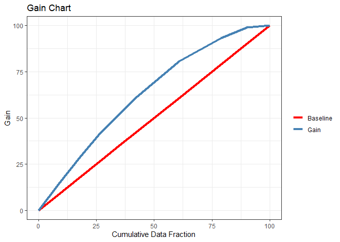<!-- -->

### XGBOOST Gain

``` r
xgb_pred_tbl %>% 
    gain_curve(high_traffic, .pred_High)  %>%
    mutate(Baseline = .percent_tested) %>% 
    rename(Gain = .percent_found) %>% 
    pivot_longer(c(Gain, Baseline)) %>% 
    ggplot(aes(.percent_tested, value, color = name)) +
    geom_line(linewidth = 1.5) +
    scale_color_manual(values = c("Gain" = "steelblue", "Baseline" = "red")) +
    theme_bw() +
    labs(title = "XGBOOST Gain Chart",
         x     = "Cumulative Data Fraction",
         y     = "Gain", color = "")
```

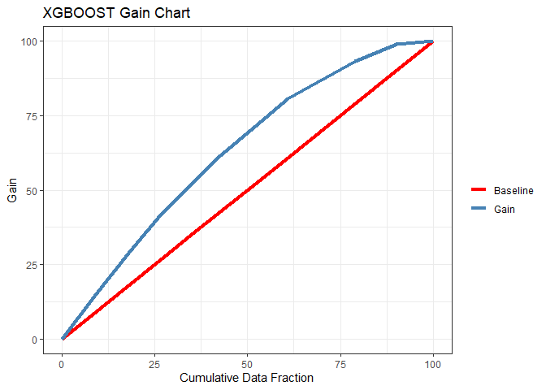<!-- -->

The gain across glmnet and xgboost is almost identical.

The way to read this chart. If we took 25% of our recipes (Cumulative
Data Fraction) without our model we would expect to get a gain of 25% of
the 604 “High” traffic recipes (baseline). With our model sorted by the
highest probability of “High” traffic, we would expect to gain close to
40% of the 604 “High” traffic recipes in the first 25% of our recipes.

### GLMNET Lift

``` r
glmnet_pred_tbl %>% 
    lift_curve(high_traffic, .pred_High)  %>%  
    mutate(Baseline = 1) %>% 
    rename(Lift = .lift) %>% 
    filter(!is.nan(Lift)) %>% 
    pivot_longer(c(Lift, Baseline)) %>% 
    ggplot(aes(.percent_tested, value, color = name)) +
    geom_line(linewidth = 1.5) +
    scale_color_manual(values = c("Lift" = "steelblue", "Baseline" = "red")) +
    theme_bw() +
    labs(title = "Lift Chart",
         x     = "Cumulative Data Fraction",
         y     = "Lift", color = "")
```

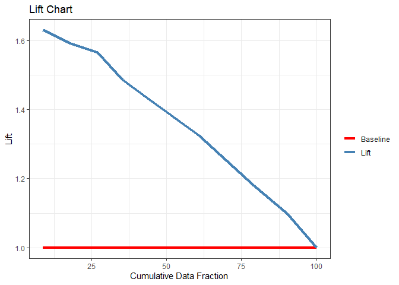<!-- -->

### XGBOOST Lift

``` r
xgb_pred_tbl %>% 
    lift_curve(high_traffic, .pred_High)  %>%  
    mutate(Baseline = 1) %>% 
    rename(Lift = .lift) %>% 
    filter(!is.nan(Lift)) %>% 
    pivot_longer(c(Lift, Baseline)) %>% 
    ggplot(aes(.percent_tested, value, color = name)) +
    geom_line(linewidth = 1.5) +
    scale_color_manual(values = c("Lift" = "steelblue", "Baseline" = "red")) +
    theme_bw() +
    labs(title = "XGBOOST Lift Chart",
         x     = "Cumulative Data Fraction",
         y     = "Lift", color = "")
```

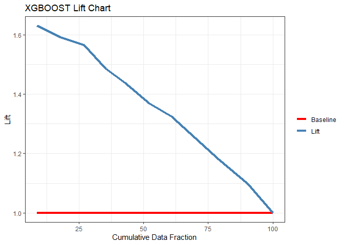<!-- -->

Again, the lift across glmnet and xgboost is almost identical.

The way to read this chart. With our model sorted by the highest
probability of “High” traffic, the first 25% of our recipes (Cumulative
Data Fraction) with our model we would expect to get a lift of close to
1.6X of what we would expect without our model (i.e. using random
chance).

## Final Summary

### Relationships Between Response & Predictors

I discovered that the most important predictor is the recipe category in
predicting “High” traffic.. Both the EDA and modeling process validate
this claim. There seems to be a mild relationship between the missing
values in the data and “High” traffic recipes.

### Evaluating Models

“They want us to predict which recipes will be popular 80% of the time
and minimize the chance of showing unpopular recipes.”

- Both models can achieve a precision of 80.42% on never before seen
  data.
- On never before seen data, 28 out of 96 (or 29.17%) “Not-High” traffic
  recipes were incorrectly classified as “High” traffic recipes.
- The baseline model (glmnet) was the best performing model in terms of
  PR AUC and ROC AUC.

In order to improve accuracy we can explore more features. The “Example
Recipe” from the instructions document included features such as:

- **Title:**: “Tomato Soup”
- **Time to make:** “2 hours”
- **Cost per serving**
- **ingredients:** “Tomatoes, Onion, Carrot, Vegetable Stock”
- **Method:** “1. Cut the tomatoes into quarters…”

These may add predictive value to our model.

### Connecting Model to Business Value

I used Gain & Lift charts to connect the best performing model to
business goals. When sorted by highest probability of “High” traffic
recipes, the first 25% of our recipes is estimated to gain close to 40%
of the “High” traffic recipes, a 15% improvement over the baseline of
25%, which translates to close to a 1.6X Lift.

### Recommendations

I recommend:

- Iteratively improving the model over time with:
  - additional features
  - additional observations
  - screening more models and preprocessing techniques
- Utilize the current model as it’s shown to meet targets and provide
  business value, time to put the model into production.
